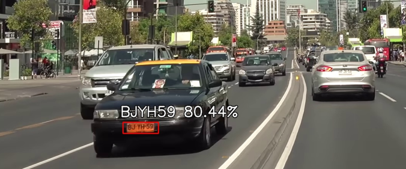
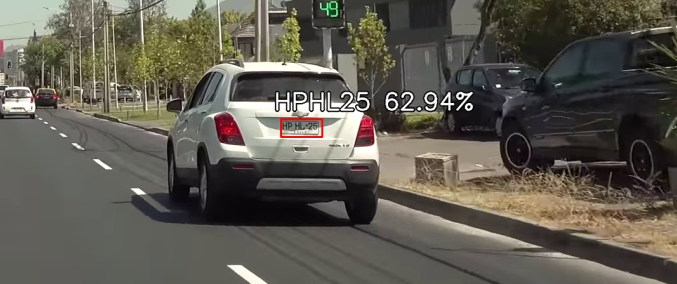
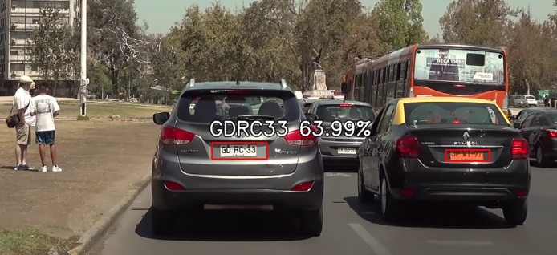
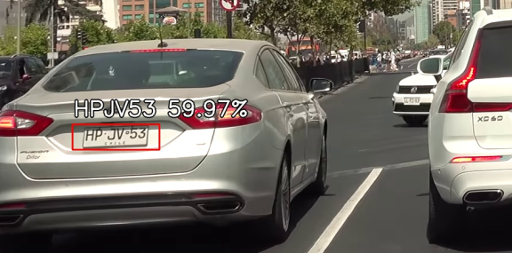

# Contexto 

Este proyecto implica la creación de un sistema de detección de placas de vehículos de bajo costo implementado en una placa Raspberry 4. Para lograr esta tarea, se entrenaron dos redes neuronales utilizando TensorFlow. La primera red se utiliza para localizar la placa en la imagen, mientras que la segunda se encarga del reconocimiento de la placa en sí.

Una vez que se ha detectado y reconocido la placa, el sistema busca en un archivo local si hay alguna alerta relacionada con esa placa en particular. Si se encuentra algún encargo, el sistema compara la patente detectada con las patentes almacenadas localmente.

Este sistema de detección de placas de vehículos es una solución innovadora y de bajo costo que puede ser implementada en una variedad de situaciones, como en áreas de alta congestión vehicular, peajes, estacionamientos públicos, entre otros. Además, la implementación en una placa Raspberry 4 hace que el proyecto sea altamente portátil y fácilmente adaptable a diversas necesidades.

# Funcionamiento

Este es un Reconocedor de Patentes Vehiculares el cual utiliza **Redes Neuronales Convolucionales**, el cual consta de dos procesos: **Localizador** y **Reconocedor**

## Localizador

El **Localizador** usa yolov4 tiny, el cual permite la localización de placas vehiculares en tiempo real. Dentro del repo existen tres versiones del modelo siendo 608x608 la resolución mas alta la cual permite mejor precisión pero requiere mas tiempo de inferencia Estos modelos se encuentran en /alpr/models/detection/.

## Reconocedor

Para el reconocedor de caracteres **OCR** se diseño un modelo especial para patentes Chilenas (m1_1.1M_CPU) con Tensorflow Keras, en este repositorios se pueden encontrar en /alpr/models/ocr siendo todos los modelos diseñados para uso óptimo en CPU. 

# Ejecución

Usar Python 3.x

## Instalación de librerías

```
pip install -r requirements.txt
```


## Ejecución

```
python reconocedor-automatico.py --cfg config.yaml
```

	
Este comando tomará automáticamente la configuración existente en config.yaml, donde:

```yaml
video:
    # fuente: 0 Cámara integrada
    #fuente: ./assets/video_local.mp4 puede ser un video local
    fuente: 0

modelo:
    # resolución localizador puede ser {608, 512, 384}
    resolucion_detector: 608

    # Considerar la localizacion por sobre x valor
    confianza_detector: 0.4

    # modelo a elegir para ocr
    numero_modelo_ocr: 1

    # Se queda solo con aquellas patentes cuyo promedio de las probabilidades delos caracteres es mayor a X
    confianza_avg_ocr: 0.7

    # Si algún carácter esta por debajo deconfianza_low_ocr, se descarta
    confianza_low_ocr: 0.5
```

 Las patentes que cumplan este umbral quedarán registradas en la carpeta /tmp .

 Las patentes con encargos se guardan en  [patentes_encargos.csv](patentes_encargos.csv)

 Se recomienda usar fuentes de video altas para mejorar el reconocimiento de caracteres.


# Lista de pendientes

1. El modelo de reconocimiento de patentes actualmente ronda un 80% de confianza, se espero ir subiendo mejoras de este modelo con el tiempo.
2. Integrar sistemas de alertas a involucrados como WhatsApp, SMS u otros.
3. Hacer eficiente el código para que sea funcional en una mayor cantidad de Hardware.

# Agradecimiento 

Este proyecto se crea a partir de [github](https://github.com/ankandrew/ConvALPR) proyecto el cual  toma como base placas Argentinas y se configura para su funcionamiento en Placas Chilenas.


|  |  |
|  |  |